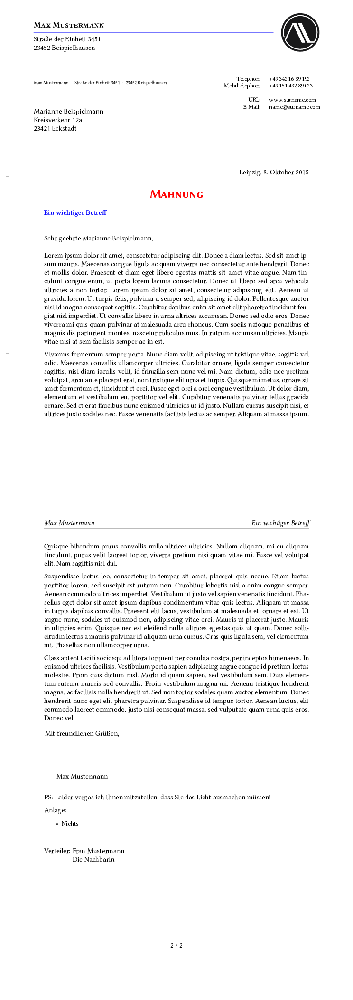

# DIN-Brief Template

A DIN letter template for pdf- or XeLaTeX.

## Quickstart

- install the package `make install`
- modify the letter-class-option example `example.lco` and save it somewhere resonable, g.e. `~/letters/lcos`
     - if you use a logo and you want to set the path to it relative from your user home, escape the `~` like this `\string~`, g.e. `\string~/letters/imgs/mylogo.pdf`
- take a look at the `example.tex` or derive from this:

```tex
\documentclass[version=last, fontsize=12pt]{scrlttr2}

\usepackage{letterAlinz}

\begin{document}

\LoadLetterOptions{letterStyleAlinz, \string~/letters/lcos/mylco}

\setkomavar{yourref}{}
\setkomavar{yourmail}{}
\setkomavar{myref}{}
\setkomavar{customer}{}
\setkomavar{invoice}{}
\setkomavar{place}{Beispielstadt}
\setkomavar{date}{\today}

\setkomavar{title}{Ein schoener langer Titel}
\addtokomafont{title}{\scshape\color{red}}

\setkomavar{subject}{Ein wichtiger Betreff}
\begin{letter}[%
%    subject=untitled,% underlined, centered, right, afteropening
    headsepline=true,%
    footsepline=false,%
    fromlogo%
]{%
    Marianne Beispielmann\\
    Kreisverkehr 12a\\
    23421 Eckstadt%
}

\opening{Sehr geehrte \usekomavar{toname},}

hier können Sie nach belieben schwafeln.

\closing{Mit freundlichen Grüßen,}

\ps PS: Leider vergas ich Ihnen mitzuteilen, dass Sie das Licht ausmachen müssen!

\setkomavar*{enclseparator}{Anlage}
\encl{{%
    \small%
    \begin{itemize}%
        \item Nichts
    \end{itemize}%
}}

\cc{%
    Frau Mustermann\\
    Die Nachbarin
}
\end{letter}

\end{document}
```

- build with `latexmk -xelatex`
- remove clutter with `latexmk -c` or `latexmk -C` which will also remove the pdfs

## Preview


